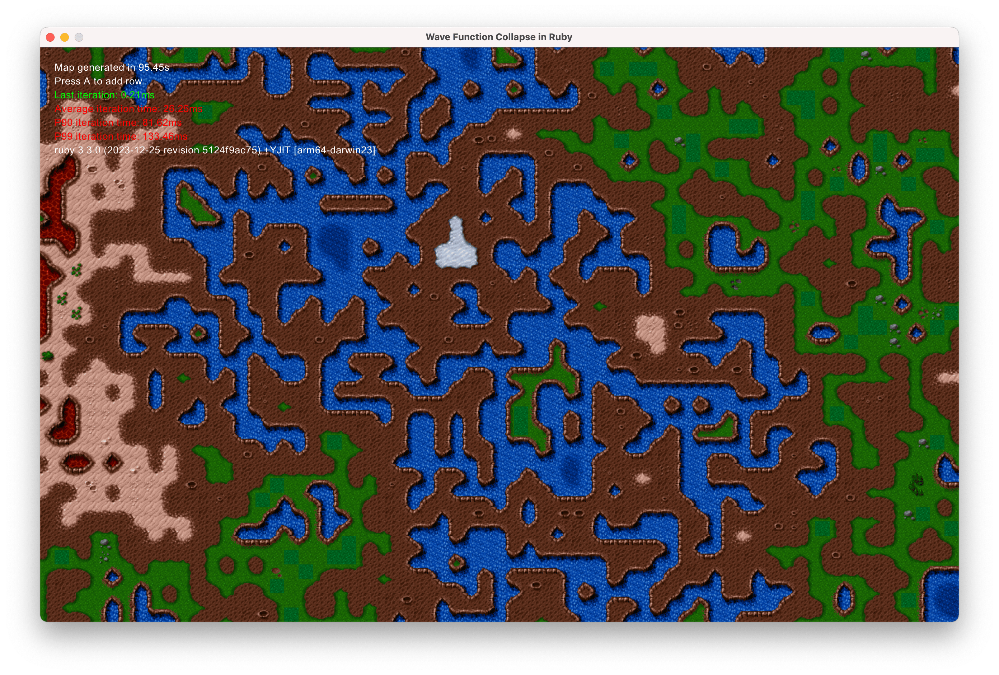

# Wave Function Collapse in Ruby

This repository is an example implementation of the [Wave Function Collapse](https://github.com/mxgmn/WaveFunctionCollapse) algorithm using [Ruby](https://www.ruby-lang.org/) and [Gosu](https://www.libgosu.org/).

The algorithm is used to generate the entire map using tiles based on the rules. Rules are defined using the [Tiled](https://www.mapeditor.org/) program and read by the Ruby program from the [TSJ](https://github.com/pusewicz/wave-function-collapse-ruby/blob/main/assets/map.tsj) file.

## Objective

Build the Wave Function Collapse algorithm in Ruby that's fast enough to iterate in a game on each frame.

## Development

After checking out the repo, run `bin/setup` to install dependencies. Then, run `rake test` to run the tests. You can also run `bin/console` for an interactive prompt that will allow you to experiment.

Run `bin/run` to run the example.

## Benchmark

Run `bin/benchmark` to see how fast the algorithm is.

#### Apple M3 Max 64GB (2023): 12.437260s

        ruby 3.3.0 (2023-12-25 revision 5124f9ac75) [arm64-darwin23]
        Run #1: Benchmark for Model(grid=20x20 entropy=188)… Finished in 11.65s
        Run #2: Benchmark for Model(grid=20x20 entropy=188)… Finished in 13.46s
        Run #3: Benchmark for Model(grid=20x20 entropy=188)… Finished in 11.89s
        Average time: 12.33499966666568
        Slowest time: 13.458501000000979
        Fastest time: 11.65374900000461

## Contributing

Bug reports and pull requests are welcome on GitHub at https://github.com/pusewicz/wave-function-collapse-ruby. This project is intended to be a safe, welcoming space for collaboration, and contributors are expected to adhere to the [code of conduct](https://github.com/pusewicz/wave-function-collapse-ruby/blob/main/CODE_OF_CONDUCT.md).

## License

The gem is available as open source under the terms of the [MIT License](https://opensource.org/licenses/MIT).

## Credits

Tileset: https://opengameart.org/content/consolidated-hard-vacuum-terrain-tilesets
